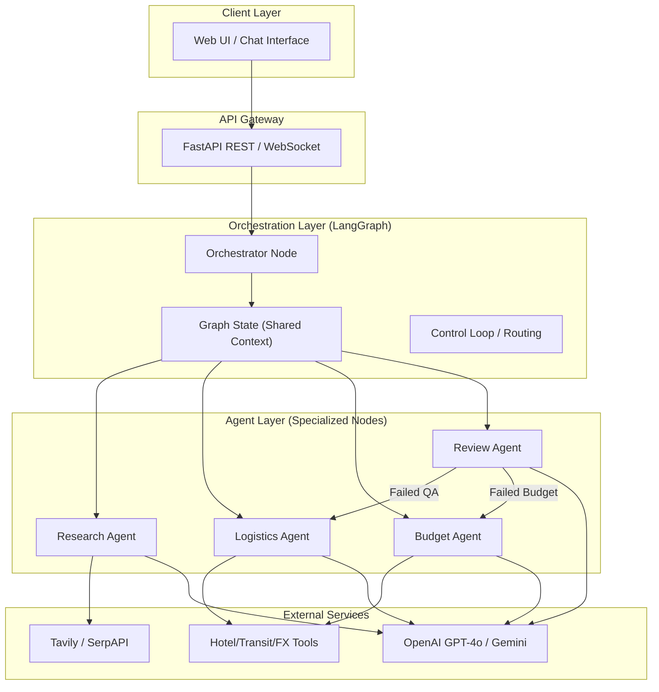

# AI Travel Planner — System Architecture

> **Version:** 1.0  
> **Date:** April 25, 2026  
> **Based on:** [prob.md](file:///d:/cursor/AI%20Trip%20planner/docs/prob.md)

---

## 1. Executive Summary
The **AI Travel Planner** is a multi-agent system designed to transform natural language travel requests into structured, validated, and budget-conscious itineraries. This architecture leverages a **LangGraph-based state machine** to orchestrate five specialized agents, ensuring a robust and iterative planning process.

---

## 2. Framework Choice: LangChain (LangGraph) vs. Scratch

For this project, we will use **LangChain with LangGraph**.

| Approach | Decision | Rationale |
| :--- | :--- | :--- |
| **LangGraph** | **Recommended** | LangGraph is specifically designed for cyclic, stateful multi-agent workflows. It handles "Review -> Fix -> Review" loops naturally via a state graph, which is critical for our Review Agent. |
| **Scratch** | **Avoid** | Building the orchestration, state persistence, and tool-calling logic from scratch would introduce unnecessary boilerplate and complexity for a system of this scale. |

---

## 3. High-Level Architecture



---

## 4. Agent Definitions

### 4.1 Orchestrator (The Router)
- **Framework Implementation:** LangGraph Supervisor/Router.
- **Responsibility:** Parses the initial `TravelRequest`, initializes the `State`, and routes the workflow to the Research Agent.

### 4.2 Destination Research Agent
- **Tools:** `TavilySearch`, `Wikipedia`.
- **Goal:** Find attractions and neighborhoods based on `preferences` (e.g., temples, food) and `avoidances` (e.g., crowds).

### 4.3 Logistics Agent
- **Tools:** `DistanceMatrix`, `HotelSearch`.
- **Goal:** Sequence the itinerary, suggest stay areas, and calculate travel times between Tokyo and Kyoto.

### 4.4 Budget Agent
- **Tools:** `CurrencyConverter`, `PriceEstimator`.
- **Goal:** Breaks down the $3,000 budget. Flags if the plan is too expensive and suggests cheaper alternatives.

### 4.5 Review Agent (The Quality Gate)
- **Responsibility:** Acts as the final node in the graph. Validates the plan against the original prompt. 
- **Feedback Loop:** If validation fails (e.g., "Too crowded" or "Over budget"), it triggers a return to the relevant agent with specific feedback.

---

## 5. Data Flow & State Management

The system uses a shared **Graph State** to pass information between agents:

```python
class AgentState(TypedDict):
    user_request: str
    constraints: dict  # Budget, Duration, Cities
    itinerary: list    # Current draft
    research_notes: list
    budget_report: dict
    qa_feedback: str   # Feedback from Review Agent
    status: str        # 'planning', 'reviewing', 'completed'
```

---

## 6. Technology Stack
- **Core:** Python 3.11+
- **Orchestration:** [LangGraph](https://python.langchain.com/docs/langgraph)
- **LLM:** Google Gemini 1.5 Flash (Free via Google AI Studio) or Llama 3 (Free via Groq)
- **Search API:** [Tavily](https://tavily.com/) (Free Tier: 1,000 searches/mo)
- **Backend:** FastAPI
- **Frontend:** Vanilla JS / HTML (with premium CSS/Gradients)

---

## 7. Directory Structure
```text
AI-Trip-Planner/
├── docs/
│   ├── prob.md
│   └── architecture.md
├── src/
│   ├── agents/          # Agent logic & prompts
│   ├── graph/           # LangGraph definition & state
│   ├── tools/           # Search, Budget, & Map tools
│   ├── api/             # FastAPI routes
│   └── main.py          # Entry point
├── frontend/            # Web interface
└── .env                 # API keys
```

---

## 8. Development Roadmap
1. **Phase 1:** Setup LangGraph structure and Orchestrator parsing.
2. **Phase 2:** Integrate Research & Logistics tools.
3. **Phase 3:** Implement Budget check & Review feedback loop.
4. **Phase 4:** Build the Web UI and API.
