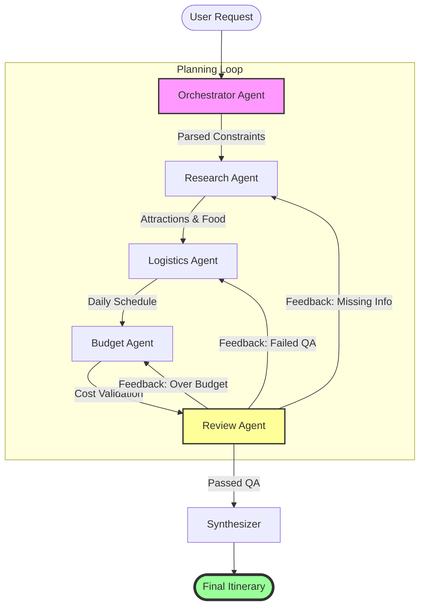
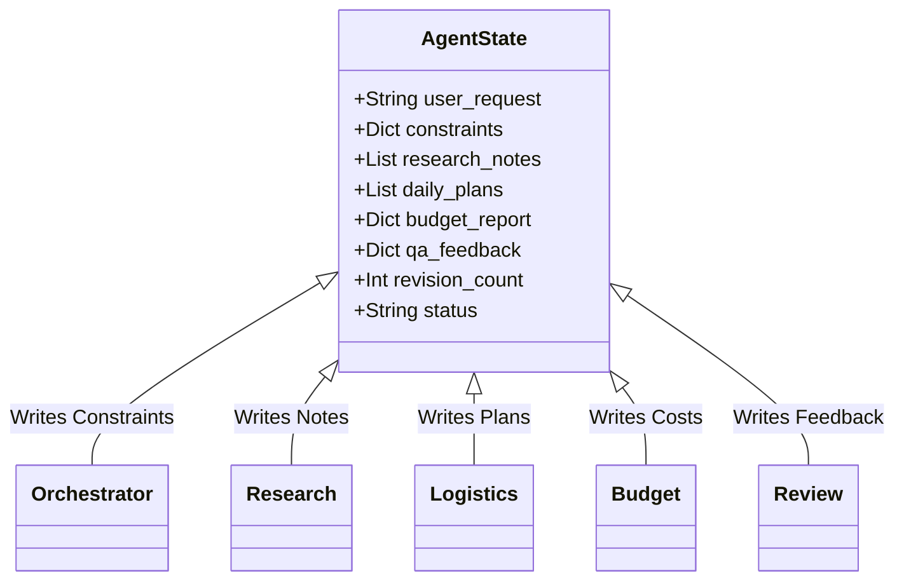
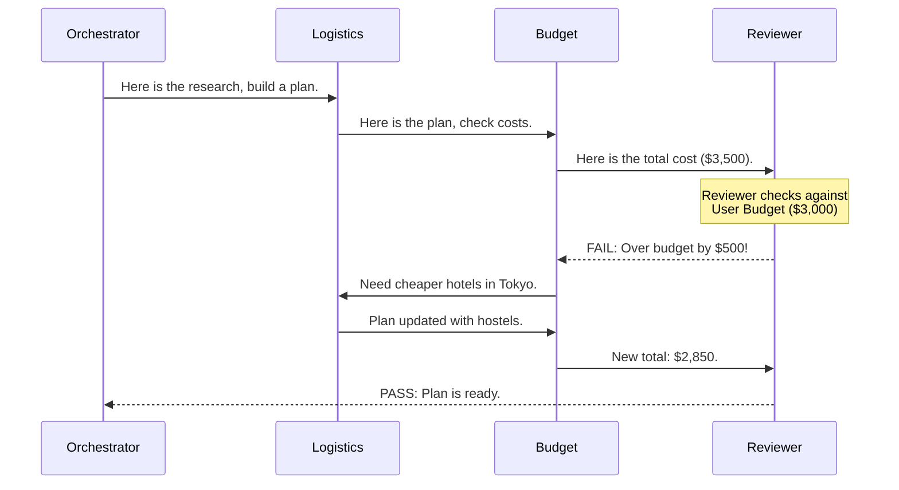
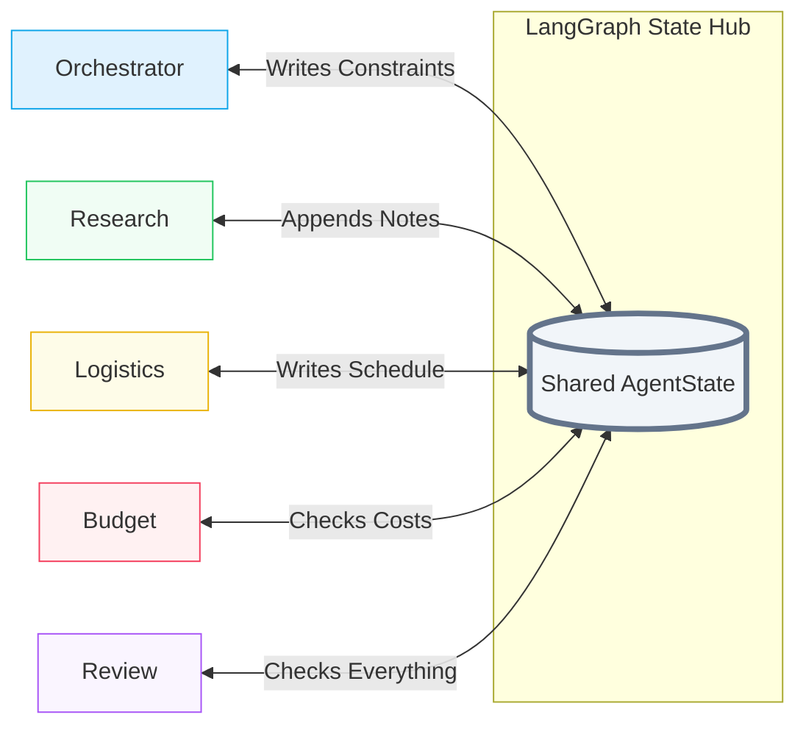

# AI Travel Planner — Agent Interaction Diagrams

This document visualizes how the 5 agents interact and share information through the LangGraph state machine.

## 1. System Workflow (Flowchart)
This diagram shows the path a travel request takes through the specialized agents.

---

## 2. Shared State Concept
All agents read from and write to a single **Shared State Object**. Think of it as a shared document that grows as the agents work.

---

## 3. The "Review -> Fix" Feedback Loop (Sequence)
This shows how the Review Agent forces other agents to self-correct until the plan is perfect.

---

## 4. Hub-and-Spoke Communication (State-Centric)
This diagram highlights that agents don't talk directly; they all interact with the **Central State Hub**.

