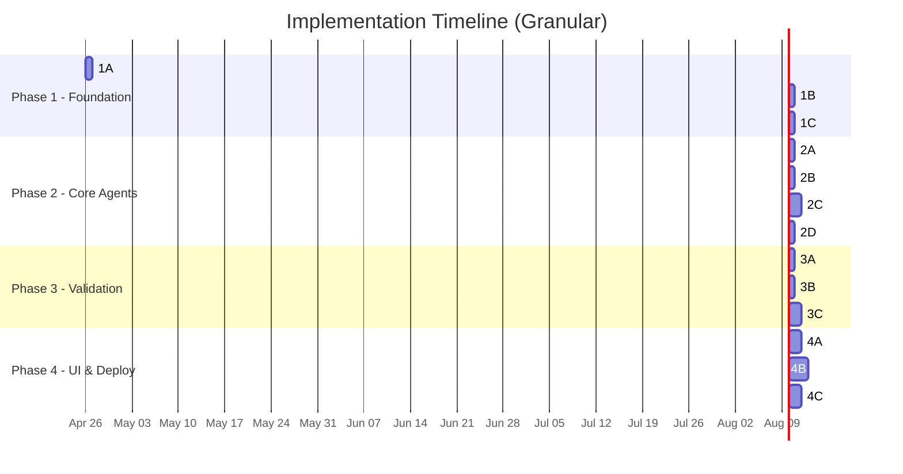
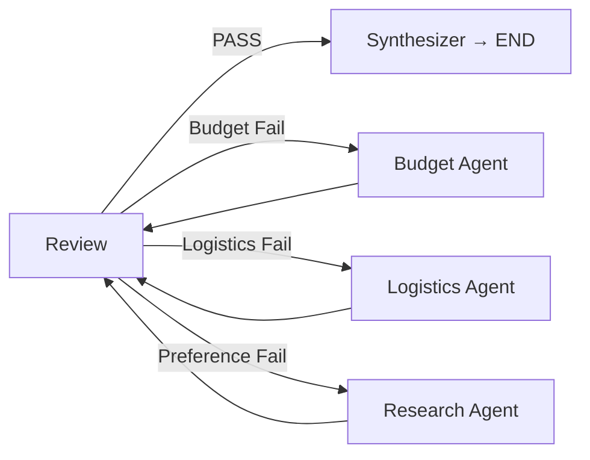

# AI Travel Planner — Phase-wise Implementation Plan

> **Version:** 2.0  
> **Date:** April 25, 2026  
> **References:** [prob.md](file:///d:/cursor/AI%20Trip%20planner/docs/prob.md) · [architecture.md](file:///d:/cursor/AI%20Trip%20planner/docs/architecture.md)

---

## Overview

The original 4 phases have been broken into **12 granular sub-phases**. Each sub-phase has a **single focused goal**, takes roughly **half a day to one day**, and ends with a testable checkpoint.

| Sub-Phase | Name | Depends On |
|-----------|------|------------|
| 1A | Project Scaffolding & Config | — |
| 1B | Graph State & Skeleton | 1A |
| 1C | Orchestrator Agent (Intent Parser) | 1B |
| 2A | Search Tool Integration | 1C |
| 2B | Destination Research Agent | 2A |
| 2C | Logistics Agent | 2B |
| 2D | Wire Research + Logistics into Graph | 2C |
| 3A | Budget Tools & Budget Agent | 2D |
| 3B | Review Agent (QA Checklist) | 3A |
| 3C | Feedback Loop & Synthesizer | 3B |
| 4A | FastAPI Backend | 3C |
| 4B | Frontend UI | 4A |
| 4C | Integration, Polish & Deployment | 4B |



---

## Sub-Phase 1A — Project Scaffolding & Config

**Goal:** Create the directory structure, virtual environment, and configuration loader. Nothing runs yet — just the skeleton.

**Tasks:**
1. Create folder structure matching `architecture.md` § 7
2. Create `requirements.txt` with all dependencies
3. Create `.env.example` | Template for `GOOGLE_API_KEY`, `GROQ_API_KEY`, `TAVILY_API_KEY`
4. Create `src/config.py` | Load env vars with `python-dotenv`, validate keys exist

**Files created:**
```
requirements.txt
.env.example
src/__init__.py
src/config.py
src/agents/__init__.py
src/graph/__init__.py
src/tools/__init__.py
src/api/__init__.py
```

**Dependencies to install:**
```text
langchain>=0.2
langgraph>=0.1
langchain-google-genai>=1.0
langchain-groq>=0.1
langchain-community>=0.2
tavily-python>=0.3
python-dotenv>=1.0
fastapi>=0.111
uvicorn>=0.30
```

### ✅ Checkpoint 1A
- [ ] `pip install -r requirements.txt` completes without errors
- [ ] `python -c "from src.config import settings"` loads config (with `.env` present)

---

## Sub-Phase 1B — Graph State & Skeleton

**Goal:** Define the shared `AgentState` TypedDict and compile a runnable LangGraph with placeholder (pass-through) nodes.

**Tasks:**
1. Define `TravelConstraints`, `DayPlan`, and `AgentState` in `src/graph/state.py`
2. Create placeholder node function that returns state unchanged
3. Build `StateGraph` in `src/graph/workflow.py` with all 6 nodes (orchestrator, research, logistics, budget, review, synthesizer) — all placeholders for now
4. Set linear edges: orchestrator → research → logistics → budget → review → synthesizer → END
5. Compile the graph

**File: `src/graph/state.py`**
```python
from typing import TypedDict, Annotated
from operator import add

class TravelConstraints(TypedDict):
    destination_country: str
    cities: list[str]
    duration_days: int
    budget_usd: float
    preferences: list[str]
    avoidances: list[str]

class DayPlan(TypedDict):
    day: int
    city: str
    morning: str
    afternoon: str
    evening: str
    estimated_cost_usd: float

class AgentState(TypedDict):
    user_request: str
    constraints: TravelConstraints | None
    research_notes: Annotated[list[str], add]
    accommodation: list[dict]
    daily_plans: list[DayPlan]
    intercity_transport: list[dict]
    budget_report: dict | None
    qa_result: dict | None
    revision_count: int
    status: str
    error: str | None
```

**Files created:**
```
src/graph/state.py
src/graph/workflow.py
```

### ✅ Checkpoint 1B
- [ ] `graph.invoke({"user_request": "test", ...})` runs end-to-end through all placeholder nodes
- [ ] No import or compilation errors

---

## Sub-Phase 1C — Orchestrator Agent (Intent Parser)

**Goal:** Build the first real agent — the Orchestrator — that uses an LLM to parse a natural-language request into a structured `TravelConstraints` dict.

**Tasks:**
1. Write system prompt in `src/prompts/orchestrator.txt`
2. Implement `orchestrator_node()` in `src/agents/orchestrator.py`:
   - Call LLM with JSON-mode output
   - Parse response into `TravelConstraints`
   - Handle missing fields with sensible defaults
3. Replace placeholder in `workflow.py` with real orchestrator node
4. Create `src/main.py` entry point

**Prompt:**
```text
Extract travel constraints from the user request. Return JSON only:
{ "destination_country", "cities", "duration_days", "budget_usd", "preferences", "avoidances" }
If any field is missing, infer a reasonable default.
```

**Test case:**
```
Input:  "Plan a 5-day trip to Japan. Tokyo + Kyoto. $3,000 budget. Love food and temples, hate crowds."
Output: { "destination_country": "Japan", "cities": ["Tokyo","Kyoto"], "duration_days": 5, "budget_usd": 3000, "preferences": ["food","temples"], "avoidances": ["crowds"] }
```

**Files created:**
```
src/agents/orchestrator.py
src/prompts/orchestrator.txt
src/main.py
```

### ✅ Checkpoint 1C
- [ ] `python -m src.main` with sample request prints parsed `TravelConstraints`
- [ ] Handles edge cases: missing budget, single city, no avoidances

---

## Sub-Phase 2A — Search Tool Integration

**Goal:** Create a reusable Tavily web search wrapper tool that agents can call.

**Tasks:**
1. Create `src/tools/search.py` — wraps `TavilySearchResults`
2. Add a helper `run_search(query: str) -> list[str]` that returns cleaned text snippets
3. Test standalone: search "best temples in Kyoto" and print results

**File: `src/tools/search.py`**
```python
from langchain_community.tools.tavily_search import TavilySearchResults

search_tool = TavilySearchResults(max_results=5, search_depth="advanced", include_answer=True)

def run_search(query: str) -> list[str]:
    results = search_tool.invoke({"query": query})
    return [r["content"] for r in results if "content" in r]
```

**Files created:**
```
src/tools/search.py
```

### ✅ Checkpoint 2A
- [ ] `run_search("best food in Tokyo")` returns 3–5 text snippets
- [ ] Handles API errors gracefully (returns empty list on failure)

---

## Sub-Phase 2B — Destination Research Agent

**Goal:** Build the Research Agent that uses the search tool to find attractions, food spots, and neighborhoods per city, filtered by user preferences.

**Tasks:**
1. Write system prompt in `src/prompts/research.txt`
2. Implement `research_node()` in `src/agents/research.py`:
   - Generate dynamic search queries from constraints (city × preference × avoidance)
   - Call `run_search()` for each query
   - Use LLM to rank/summarize results into concise `research_notes`
3. Replace placeholder in `workflow.py`

**Dynamic query generation:**
```python
queries = []
for city in constraints["cities"]:
    for pref in constraints["preferences"]:
        queries.append(f"best {pref} in {city} {constraints['destination_country']}")
    for avoid in constraints["avoidances"]:
        queries.append(f"how to avoid {avoid} in {city}")
```

**Output → `state.research_notes`:**
```
["Tokyo — Senso-ji: Iconic temple, go before 8AM to avoid crowds.",
 "Kyoto — Fushimi Inari: Visit at sunrise for solitude.",
 "Kyoto — Nishiki Market: 'Kyoto's Kitchen', excellent for food lovers."]
```

**Files created:**
```
src/agents/research.py
src/prompts/research.txt
```

### ✅ Checkpoint 2B
- [ ] Research Agent returns ≥ 5 relevant notes for the Japan example
- [ ] Notes cover both "food" and "temples" preferences
- [ ] Notes mention crowd-avoidance tips

---

## Sub-Phase 2C — Logistics Agent

**Goal:** Build the Logistics Agent that takes research notes and produces a day-by-day itinerary with accommodation and intercity transport.

**Tasks:**
1. Write system prompt in `src/prompts/logistics.txt`
2. Implement `logistics_node()` in `src/agents/logistics.py`:
   - Allocate nights proportionally across cities
   - Plan intercity transport (mode, cost, day)
   - Sequence activities into morning / afternoon / evening per day
   - Include estimated cost per activity
3. Replace placeholder in `workflow.py`

**Prompt rules for LLM:**
- Allocate nights proportionally across cities
- Place intercity travel on morning slots
- Group geographically close activities on same day
- Each day must have morning + afternoon + evening
- Include estimated USD costs

**Output → `state.accommodation`, `state.intercity_transport`, `state.daily_plans`**

**Files created:**
```
src/agents/logistics.py
src/prompts/logistics.txt
```

### ✅ Checkpoint 2C
- [ ] Logistics Agent produces exactly N day-plans for an N-day trip
- [ ] All requested cities appear in the plan
- [ ] Each day has morning, afternoon, and evening activities
- [ ] Accommodation splits across cities are reasonable

---

## Sub-Phase 2D — Wire Research + Logistics into Graph

**Goal:** Connect the real Research and Logistics agents into the graph and run the first meaningful end-to-end pipeline.

**Tasks:**
1. Update `workflow.py` to import and register real agent nodes
2. Run full pipeline: Orchestrator → Research → Logistics → (placeholder budget/review) → END
3. Test with 3 different travel requests to verify generalization

**Test requests:**
1. `"5-day Japan trip, Tokyo + Kyoto, $3000, food and temples, avoid crowds"`
2. `"3-day Paris trip, $1500, museums and cafes"`
3. `"7-day Thailand trip, Bangkok + Chiang Mai, $2000, beaches and street food"`

### ✅ Checkpoint 2D
- [ ] All 3 test requests produce a raw (unbudgeted) day-by-day itinerary
- [ ] No crashes or LLM parsing failures
- [ ] Output is readable and logically sequenced

---

## Sub-Phase 3A — Budget Tools & Budget Agent

**Goal:** Build the currency tool and the Budget Agent that validates costs against the user's budget ceiling.

**Tasks:**
1. Create `src/tools/currency.py` — static exchange rate map + `convert_to_usd()`
2. Write system prompt in `src/prompts/budget.txt`
3. Implement `budget_node()` in `src/agents/budget.py`:
   - Sum costs from `daily_plans` + `accommodation` + `intercity_transport`
   - Break down into categories (Stay, Transport, Food, Activities, Buffer)
   - Apply traffic-light rules: Green (≤90%), Yellow (90-100%), Red (>100%)
   - If Red: use LLM to generate savings suggestions
4. Replace placeholder in `workflow.py`

**Traffic-light rules:**
| Status | Condition | Action |
|--------|-----------|--------|
| 🟢 Green | Total ≤ 90% of budget | Pass |
| 🟡 Yellow | 90–100% of budget | Pass with warning |
| 🔴 Red | > 100% of budget | Fail + savings suggestions |

**Files created:**
```
src/tools/currency.py
src/agents/budget.py
src/prompts/budget.txt
```

### ✅ Checkpoint 3A
- [ ] Budget Agent produces a complete breakdown with correct arithmetic
- [ ] A $3000 plan costing $2650 returns status "green"
- [ ] A deliberately expensive plan returns "red" with suggestions

---

## Sub-Phase 3B — Review Agent (QA Checklist)

**Goal:** Build the Review Agent that validates the final itinerary against all original constraints.

**Tasks:**
1. Write system prompt in `src/prompts/review.txt`
2. Implement `review_node()` in `src/agents/review.py`:
   - Run 7 validation checks (see table below)
   - Return verdict (PASS / FAIL), score, and list of failed checks
3. Replace placeholder in `workflow.py`

**Validation checklist:**

| # | Check | Rule |
|---|-------|------|
| 1 | Duration | `len(daily_plans) == duration_days` |
| 2 | Cities | All requested cities appear |
| 3 | Budget | `budget_report.status != "red"` |
| 4 | Preferences | ≥ 60% of activities match preferences |
| 5 | Avoidances | No avoided items without mitigation |
| 6 | Feasibility | No day > 14 hours of activity |
| 7 | Completeness | Every day has morning + afternoon + evening |

**Files created:**
```
src/agents/review.py
src/prompts/review.txt
```

### ✅ Checkpoint 3B
- [ ] Review Agent returns PASS for a well-formed Japan itinerary
- [ ] Returns FAIL with correct `failed_checks` for a broken plan (e.g., missing a city)

---

## Sub-Phase 3C — Feedback Loop & Synthesizer

**Goal:** Implement the conditional "review → fix → re-review" loop and the final Synthesizer that produces a polished itinerary.

**Tasks:**
1. Add `review_router()` function — routes to budget/logistics/research based on failed checks
2. Replace linear `review → END` edge with `add_conditional_edges()` in `workflow.py`
3. Add `revision_count` increment logic to prevent infinite loops (max 3 revisions)
4. Implement `synthesizer_node()` in `src/agents/synthesizer.py` — merges all state into a formatted itinerary
5. Full end-to-end testing

**Router logic:**
```python
def review_router(state) -> str:
    if state["revision_count"] >= 3 or state["qa_result"]["verdict"] == "PASS":
        return "synthesizer"
    failed = state["qa_result"]["failed_checks"]
    if "budget_ok" in failed:
        return "budget"
    if any(c in failed for c in ["duration_fit","cities_covered","feasibility","completeness"]):
        return "logistics"
    return "research"
```

**Feedback loop:**


**Files created:**
```
src/agents/synthesizer.py
src/prompts/synthesizer.txt
```

### ✅ Checkpoint 3C
- [ ] Deliberately over-budget request triggers Budget → Review loop
- [ ] Loop terminates after max 3 revisions
- [ ] Synthesizer produces a clean, human-readable itinerary
- [ ] Full pipeline works end-to-end for the canonical Japan example

---

## Sub-Phase 4A — FastAPI Backend

**Goal:** Expose the pipeline via REST API and WebSocket for live streaming.

**Tasks:**
1. Create `src/api/schemas.py` — Pydantic models for request/response
2. Create `src/api/routes.py` — FastAPI app with endpoints
3. Add session storage (in-memory dict for now)
4. Add background task runner for the LangGraph pipeline
5. Add WebSocket endpoint for live agent progress

**Endpoints:**

| Method | Path | Description |
|--------|------|-------------|
| `POST` | `/api/plan` | Submit request → returns `session_id` |
| `GET` | `/api/plan/{id}` | Get completed itinerary |
| `GET` | `/api/plan/{id}/status` | Poll progress |
| `WS` | `/ws/plan/{id}` | Stream live agent updates |

**Files created:**
```
src/api/schemas.py
src/api/routes.py
```

### ✅ Checkpoint 4A
- [ ] `uvicorn src.api.routes:app` starts without errors
- [ ] `POST /api/plan` triggers pipeline and returns session ID
- [ ] `GET /api/plan/{id}` returns completed itinerary after processing
- [ ] WebSocket streams agent status messages

---

## Sub-Phase 4B — Frontend UI

**Goal:** Build a premium dark-mode single-page app to interact with the API.

**Tasks:**
1. Create `frontend/index.html` — page structure with semantic HTML
2. Create `frontend/styles.css` — dark-mode design system with design tokens
3. Create `frontend/app.js` — API calls, WebSocket handling, DOM rendering

**UI Components:**

| Component | Detail |
|-----------|--------|
| **Hero Input** | Glassmorphism card, gradient bg, textarea + submit button |
| **Agent Stepper** | Horizontal: Parsing → Researching → Planning → Budgeting → Reviewing → Done |
| **Itinerary Timeline** | Vertical timeline with day cards (morning/afternoon/evening) |
| **Budget Gauge** | Donut chart or progress bars per category |
| **QA Badge** | Score pill (green/yellow/red) |

**Design tokens:**
```css
:root {
    --bg-primary: #0f0f1a;
    --bg-card: #1a1a2e;
    --accent: #7c3aed;
    --text-primary: #e2e8f0;
    --success: #22c55e;
    --warning: #f59e0b;
    --danger: #ef4444;
    --font-main: 'Inter', sans-serif;
}
```

**Files created:**
```
frontend/index.html
frontend/styles.css
frontend/app.js
```

### ✅ Checkpoint 4B
- [x] UI loads in browser and connects to backend
- [x] Submitting a request shows live agent progress via stepper
- [x] Itinerary renders as styled day cards
- [x] Budget breakdown displays visually
- [x] Responsive on mobile viewports

---

## Sub-Phase 4C — Integration, Polish & Deployment

**Goal:** Harden error handling, add caching, write README, and containerize.

**Tasks:**
1. Add error handling: graceful UI states for LLM timeouts / API failures
2. Add loading states: skeleton loaders while agents work
3. Add response caching: cache identical queries in-memory
4. Add LLM provider fallback: OpenAI → Gemini → Groq on failure
5. Write `README.md` with setup instructions and screenshots
6. Create `Dockerfile` for containerized deployment
7. Final end-to-end smoke test

**Files created:**
```
README.md
Dockerfile
.dockerignore
```

### ✅ Checkpoint 4C
- [x] LLM timeout triggers fallback provider, not a crash
- [x] Duplicate request returns cached result instantly
- [x] `docker build && docker run` starts the full app
- [x] README covers: setup, env vars, running locally, architecture overview

---

## Summary: Files Created Per Sub-Phase

| Sub-Phase | Files |
|-----------|-------|
| **1A** | `requirements.txt`, `.env.example`, `src/config.py`, `src/*/__init__.py` |
| **1B** | `src/graph/state.py`, `src/graph/workflow.py` |
| **1C** | `src/agents/orchestrator.py`, `src/prompts/orchestrator.txt`, `src/main.py` |
| **2A** | `src/tools/search.py` |
| **2B** | `src/agents/research.py`, `src/prompts/research.txt` |
| **2C** | `src/agents/logistics.py`, `src/prompts/logistics.txt` |
| **2D** | *(updates to `workflow.py` only)* |
| **3A** | `src/tools/currency.py`, `src/agents/budget.py`, `src/prompts/budget.txt` |
| **3B** | `src/agents/review.py`, `src/prompts/review.txt` |
| **3C** | `src/agents/synthesizer.py`, `src/prompts/synthesizer.txt` |
| **4A** | `src/api/schemas.py`, `src/api/routes.py` |
| **4B** | `frontend/index.html`, `frontend/styles.css`, `frontend/app.js` |
| **4C** | `README.md`, `Dockerfile`, `.dockerignore` |
